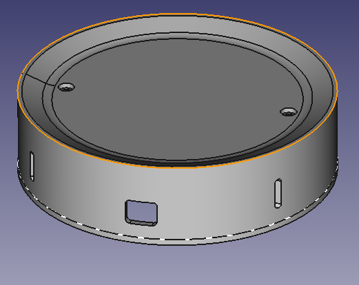
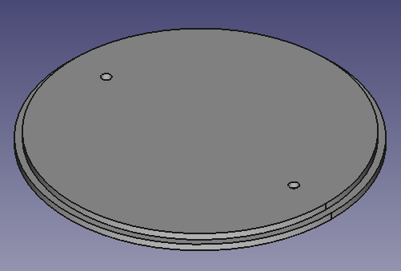

## EXPERIMENTAL!
This FreeCad model is made as a stand case for an echo plus device. 
Actually I hope that it fits approximately. I don't have any Echo device. So I don't have the possibility to check it properly :).
This model was made to provide a case where you can install small dev boards, etc, and place an echo device on it.
Top and bottom can be fixed with stand-off hex brass as in my privious raspberry pi case model.

 
**Images**
 

 

# LICENSE

<dl>
 Dieses Werk ist lizenziert unter einer <a rel="license" href="http://creativecommons.org/licenses/by/4.0/">Creative Commons Namensnennung 4.0 International Lizenz</a>.
</dl>
